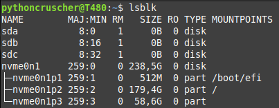
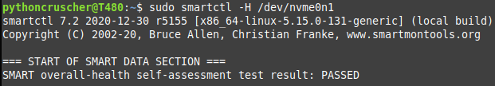
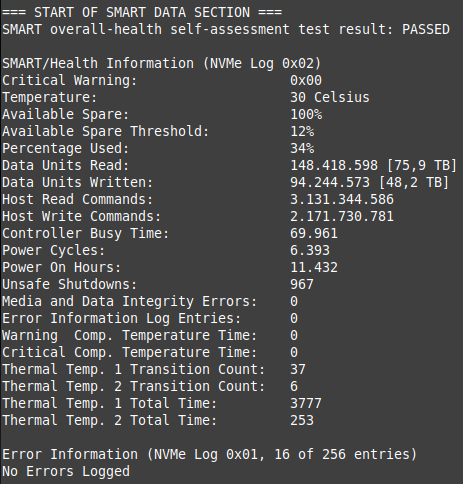

# Smartctl
it's an SSD health analyzer. You can get important data concerning TBW, count-on hours, temp, etc.

# Check SSD

```bash
lsblk
```  


# Installation

Smartctl is part of the smartmontools package, so that's what needs to be installed.

```bash
sudp apt install smartmontools
```  

### Check installation
```bash
sudo smartctl --version
```

### Check SSD health
```bash
sudo smartctl -H /dev/nvme0n1
```  


### Get ssd Data
```bash
sudo smartctl -a /dev/nveme0n1
```  
